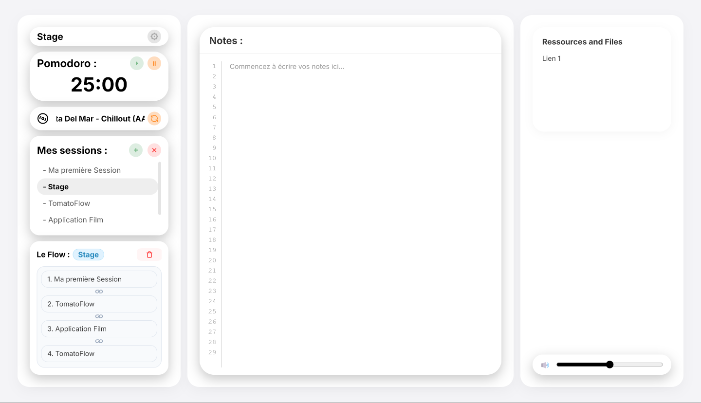
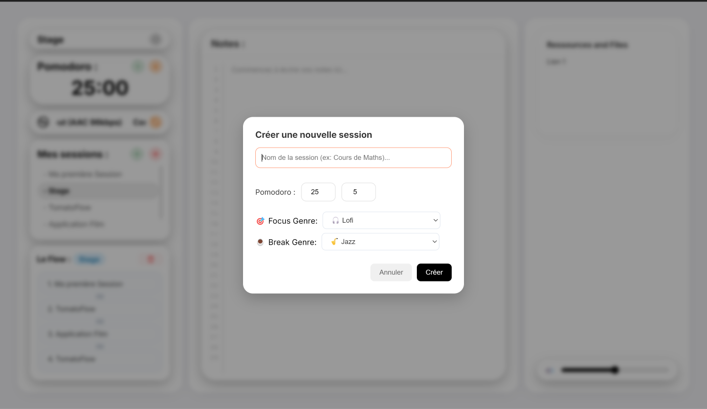
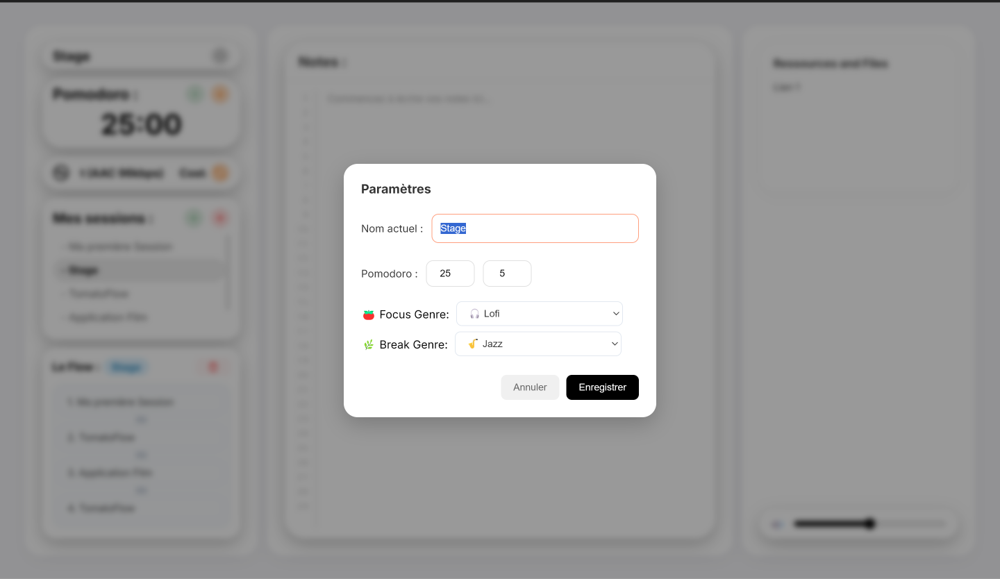

# 🍅 TomatoFlow

TomatoFlow est une application de bureau dédiée à la productivité avancée et basée sur la méthode Pomodoro. Développée en **JavaScript natif (Vanilla JS)** et propulsée par **Electron**, elle offre un espace de travail minimaliste, immersif et entièrement autonome.

  

---

## ✨ Fonctionnalités clés

* **⏱️ Minuteurs Pomodoro par Session :** Créez des sessions de travail indépendantes (ex: *Développement*, *Maths*). Chaque session possède sa propre configuration de temps (ex: 25/5 min ou 55/5 min).
* **⛓️ Système de Flow Séquentiel :** Enchaînez automatiquement des sessions différentes (ex: *Maths ➔ Informatique ➔ Physique*). Dès qu'un cycle se termine, l'application passe seule à la suite. Chaque session conserve ses notes, ses timers et ses musiques.
* **📝 Éditeur de Notes Persistant :** Un espace de prise de notes avec numérotation dynamique, sauvegardé automatiquement dans le `localStorage` et lié de manière unique à la session active.
* **📻 Streaming Audio Intelligent :** Connexion directe à l'API *Radio Browser* pour diffuser des musiques adaptées à votre état (Lofi pour le *Focus*, Jazz pour la *Pause*, Synthwave pour le mode *Boost*).

---

## 📸 Aperçu des Modules

  
  

---

## 🛠️ Stack Technique

* **Framework de Bureau :** Electron (Runtime Chromium & Node.js)
* **Frontend :** HTML5 sémantique & CSS3 moderne (Architecture à 3 panneaux, Flexbox, backdrop-filter).
* **Logic Core :** JavaScript ES6+ asynchrone (`fetch`, `Promises`) et API Audio native.
* **Persistance :** Web Storage API (`localStorage`).

---

## 🚀 Téléchargement et Utilisation

L'application est fournie en version **portable**, aucune installation sur votre système n'est requise.

1. Rendez-vous dans l'onglet **Releases** de ce dépôt GitHub.
2. Téléchargez le fichier exécutable correspondant à votre système (`TomatoFlow.exe` pour Windows ou `.dmg` pour macOS).
3. Double-cliquez sur le fichier téléchargé pour lancer instantanément TomatoFlow.  